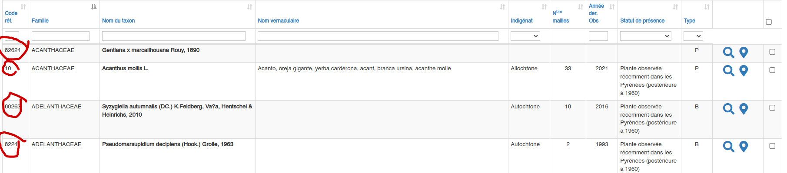

# florapyr-scraper

## What is this

This is a scraper designed to extract species observations information from http://www.atlasflorapyrenaea.eu/. Given a list of species IDs, the program will obtain all their observations and, for each of those, it will extract their _id_, _year_, _town_, _altitude_, _utm1x1_ and _utm10x10_, as obtained per the usual manual process from the website.

You input your species as in [this txt](examples/input_get_observations_example.txt).

and you get your observations as in [this json](examples/out_observations_example.json) and [this csv](examples/out_observations_example.csv).

## How to use

### Download Python3
https://www.python.org/downloads/

### Clone this project
Command line: `git clone https://github.com/jcasado94/florapyr-scraper.git your-desired-directory`

Or simply download the zip and extract it: https://github.com/jcasado94/florapyr-scraper/archive/refs/heads/main.zip

### Fill `input_get_observations.txt`
Write a newline-separated list of species IDs from FloraPyr into `input_get_observations.txt` (see the example in [input_get_observations_example.txt](examples/input_get_observations_example.txt)), as obtained from the site in *Taxons > Fiches Taxons*, and as exemplified in the following screenshot

(There is a _hidden functionality_ to let the user input the species names instead of the species IDs, as I thought that'd be easier for them. Nevertheless, it currently relies on string comparison between given taxa names and FloraPyr accepted names, and therefore it is not robust enough and not recommended to use (it will misbehave with discordant taxa, especially subspecies). It can be triggered by changing `inputAsSpeciesName = False` to `inputAsSpeciesName = True` in `get_observations.py`. Manually fetching species IDs from FloraPyr is way more stable and reliable.)

### Execute!
`python3 get_observations.py`

### Read your observations
The retrieved observations will be written to `out_observations.csv` and `out_observations.json`. Choose whichever you prefer :).

## Is this RELIABLE?

This is reliable as long as FloraPyr servers and their database information are reliable. This program is simply simulating the request flow (you could say as well, the "click flow") in FloraPyr from _Species selection > Recherche > Observation listing > Individual observation selection_, and putting all those individual observations into a single file (it is essentially saving you a trillion clicks and days or weeks of work). That being said, there are potential inconsistencies both in the information provided for the observations and (in my experience) in the set of observations that FloraPyr returns from the server.

In the first case -- and as you would expect from a database with such old and diverse information --, it is *very common* to find species observations without some of the extracted parameters (year, town, altitude, utm1x1, or utm10x10), or with the utm10x10 set as the utm1x1... This shouldn't come as a surprise to the experienced FloraPyr user, and one might perhaps obtain more accurate information by consulting the individual observation in the referenced article. So, if the data returned by the script is lacking some parameters or they appear inconsistent, it's simply because FloraPyr has the information stored that way. 

In the second case, I've seldomly experienced inconsistencies in the returned observations for a set of species. Sometimes, I might be requesting for observations of _Sphagnum warnstorfii_ and _Sphagnum teres_, and I might get all the observations for those species and for another species, like _Viola palustris_. And this is just what I've found and it's not so awful -- I sill got all the observations that I wanted, despite the extra ones. But imagine that the servers _decided_ to just give me the observations for _S. teres_... Therefore, I can never assure that FloraPyr servers will work correctly and will always respond with the requested observations, since I have no idea how they work -- and of course that would happen too with the usual website graphical process.